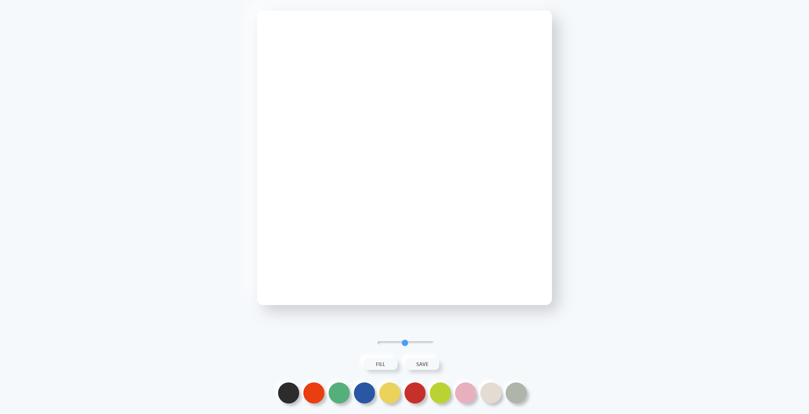

# paintJS
painting board made with **Vanilla JS**

## Deployment

[github pages](https://hyunchoitan.github.io/paintJS/)

## Demo Image

.png)

## Technologies

This project is created with 
*  
* 
* 

## Features

* Canvas
* 2D Painting
* 2D Context
* Changing brush color
* Changing brush size
* Save final image
* Neumorphism UI

## The Project Status

- [x] Canvas Events
- [x] 2D Context
- [x] Changing color
- [x] Changing brush size
- [x] Filling the canvas mode
- [x] Saving the image
- [x] Neumorphism
- [x] Deploy
 